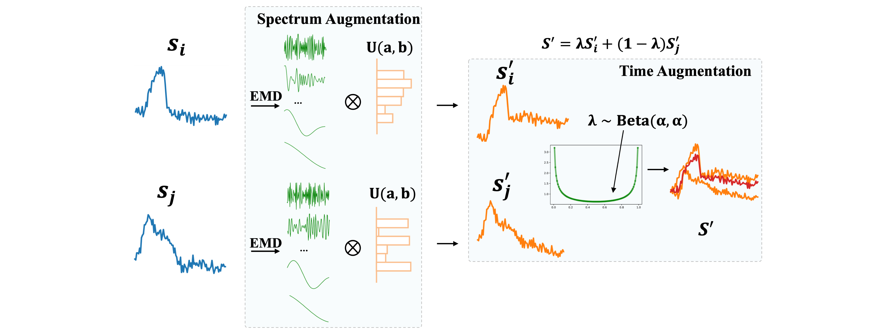

# STAug
This is the official implementation for ICASSP'23 paper [Towards Diverse and Coherent Augmentation for Time-Series Forecasting](https://arxiv.org/abs/2303.14254). We combine Spectral and Time Augmentation (STAug) for generating more diverse and coherent samples. 

Specifically, in the frequency domain, we use the Empirical Mode Decomposition to decompose a time series and reassemble the subcomponents with random weights. This way, we generate diverse samples while being coherent with the original temporal relationships as they contain the same set of base components. In the time domain, we adapt a mix-up strategy that generates diverse as well as linearly in-between coherent samples. 

Experiments on five real-world time-series datasets demonstrate that STAug outperforms the base models without data augmentation as well as state-of-the-art augmentation methods.


*An overview of our STAug: For frequency-domain augmentation, we decompose two random series (marked in blue) with Empirical Mode Decomposition (EMD), and then reassemble the subcomponents with random weights sampled from uniform distribution to obtain intermediate samples (marked in orange). In the time domain, we further linearly mix the intermediate samples to obtain the final augmented series (marked in red) for training.*


## Dataset

Exchange: exchange rate data, available under `./dataset`

ETTh1, ETTh2, ETTm1, ETTm2: electricity dataset, available at https://drive.google.com/drive/folders/1o12CLtmUVt0C8xWpS1tSCiYHgDhr7L9J?usp=sharing. Download the dataset and put the folder under `./dataset`. The final dataset structure is `./dataset/ETT-small/`

## Quick Start

```
https://github.com/xiyuanzh/STAug.git
cd STAug
```

train and evaluate STAug on all five dataset:

```bash ./scripts/run.sh```

`emd_scale`: emd_scale = 1: compute Empirical Mode Decomposition for the entire sequence (more efficient); emd_scale = 0: separately compute Empirical Mode Decomposition for each segment 

## Citation

If you find the code useful, please cite our paper:

```
@inproceedings{zhang2023towards,
  title={Towards Diverse and Coherent Augmentation for Time-Series Forecasting},
  author={Zhang, Xiyuan and Chowdhury, Ranak Roy and Shang, Jingbo and Gupta, Rajesh and Hong, Dezhi},
  booktitle={ICASSP 2023-2023 IEEE International Conference on Acoustics, Speech and Signal Processing (ICASSP)},
  pages={1--5},
  year={2023},
  organization={IEEE}
}
```